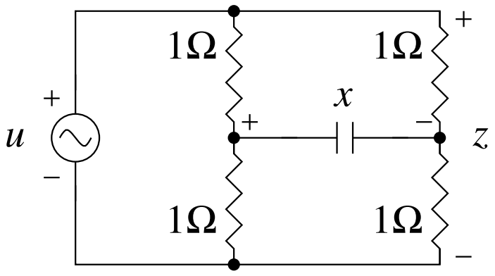
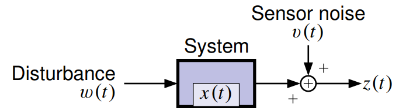

## Kalman Filtering

* Internal/hidden 'state' of a dynamic system
* Uses sensor measurements + model
* De-facto standard in many engineering applications
    + GPS position/speed estimates
    + Motion capture
    + Even financial markets
    + A lot more ....too lazy to mention

# Mathematical Background
{#fig:background}

# Observability (the spoilsport)
{#fig:observability}

# Process and Sensor Noise
{#fig:noise}

# Forward vs Inverse Problems

## Forward Problem -- Simulation
{#fig:fwd}

## Inverse Problem -- Estimation
{#fig:inv}

# Mathematical Background + Domain Knowledge
{#fig:background_battery}

# Application to Non-Linear Systems
The discrete-time state-evolution of a continuous-time generic non-linear system can be represented by the semi-explicit system of DAEs
\begin{align}
    x_{k+1} &= x_k + \int_{(k)\Delta t}^{(k+1)\Delta t}f\left(x(t),z(t)\right)dt + w_{k+1} + u_k\\
    g\left(x(t),z(t)\right) &= 0  \quad, (k)\Delta t \le t \le (k+1)\Delta t\\
    y_{k+1} &= h\left(y(t),z(t)\right) + v_{k+1}
\end{align}
$x$ represents differential states, $z$ represents algebraic states, $f$ is the state equation, $g$ represents the set of algebraic constraints, $h$ represents the output function, $u$ represents the process noise with co-variance matrix $Q$ and $v$ represents sensor noise with co-variance matrix $R$ respectively.

# Multi-pronged approach (100s of papers)
* Kalman Filter Family
    - Extended Kalman Filter
    - Sigma Point Kalman Filter
    - Unscented Kalman Filter
    - Ensemble Kalman Filter
* Moving Horizon Estimator
* Leuenberger Observer
* Sliding Mode Observer
* Particle Filter
* PDE Backstepping Observer
* Feedback Particle Filter